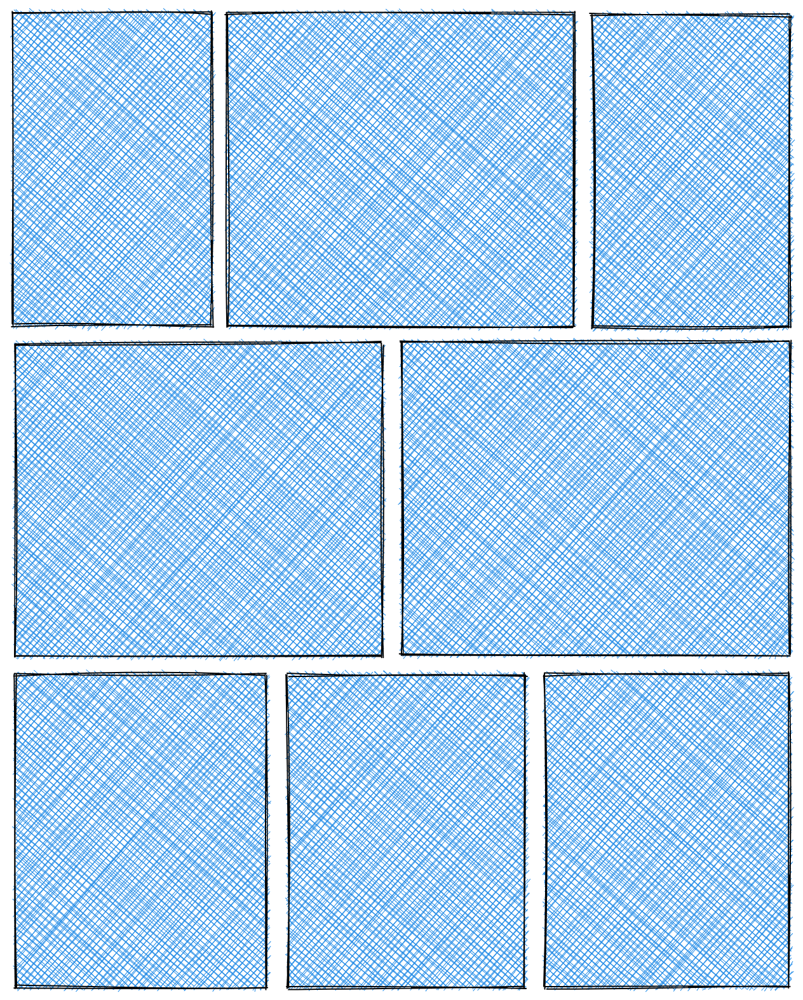

When I set to build a webpage for my photography, laying out the photos in a grid was the biggest challenge. It turns out displaying photos of different aspect ratios in a grid is not that simple and there are a few trade-offs that have to be made. In this post, I describe the way I implemented such a layout. To see the result, check out my [photography page](https://photos.lucianbc.com/).

## Problem description

We want to display multiple photos in something similar to feed, with multiple photos per row. We also want this grid to be responsive, meaning that on wider devices it shows multiple photos, while on mobile phones it shows one or a maximum of two photos per row. The photos should have some space between them, let's say 10 pixels.

As for the layout, we want the photos to be displayed in something that could be called a staggered horizontal grid, meaning a variable number of photos per row. I like how this layout creates a brick-wall pattern, accomodating both landscape and portrait photos and keeping straight rows and a left-to-right focus. However, making this layout responsive, fast and with no javascript at runtime required a few tricks.


_Horizontal Staggered Grid_

## Implementation details

This layout was popularised by apps such as [flickr](https://www.flickr.com/search/?text=landscape) and [500px](https://500px.com/search?q=landscape&type=photos&sort=relevance). Flicker open-sourced their algorithm for creating the photo grid on their website and wrote a blog post about it [here](https://code.flickr.net/2016/04/05/our-justified-layout-goes-open-source/). I based my solution on their algorithm, but I won't go into details of how it works. Their observation was that you can't build a photo grid with a consistent row height, while also accomodating a collection of photos with arbitrary aspect ratios and in an arbitrary order. However, you don't need consistent row heights for the layout to look good, and laying out photos one by one, deciding whether to add the current photo to the last row or create a new one leads to a good enough solution.

Simply using this algorithm and also having the layout being responsive requires running it on every window resize. It also has the typical problem with client-side rendering - displaying the photos only after the initial page renders and having to support an initial, empty state. I wanted my page to be fast and server-side rendered.

### Pre-rendering layouts

To get past the initial load issue, I figured out I can run the Flickr algorithm at build time. Moreover, to make the layout responsive, I can create multiple configurations for the Flickr algorithm, one for each media query that I want to support. These configurations specify a layout width and the desired height and yield an array of boxes with absolute values (in pixels) for the width and height of each photo in my collection. To make the photos resizable, I can divide the width of each box to the container width how much per cent of the full width each photo should take. Then I render each photo in a `flexbox` container and with the `flex: 0 0 ${box.widthPercent}` CSS property. I used [gatsby](https://www.gatsbyjs.com/) to build my page, which allowed me to use react and [styled-components](https://styled-components.com/) to interpolate the javascript-computed `box.widthPercent` into CSS media-queries and have all of this logic run at built time. The simplified code that implements what is described above:

```js
// import the Flickr algorithm
import layout from "justified-layout";

const breakPoints = [
  // media query is null for the default style
  { mediaQuery: null, containerWidth: 400 },
  { mediaQuery: 568, containerWidth: 600 },
  // add more if needed
];

const PhotoGrid = ({ photos }) => {
  const ratios = photos.map((photo) => photo.aspectRatio);
  const layouts = breakPoints.map((breakPoint) => ({
    breakPoint,
    layout: layout(ratios, {
      boxSpacing: 0,
      containerPadding: 0,
      containerWidth: breakPoint.containerWidth,
    }),
  }));

  const getRatiosAndBreakpointsForPhoto = (photoIndex) => {
    // returns an array containing the media query and the width percentage the photo should take on that media query
    // example: [{ mediaQuery: null, ratio: 0.3 }, { mediaQuery: null, ratio: 0.8 }]
    return layouts.map((layout) => ({
      mediaQuery: layout.breakPoint.mediaQuery,
      ratio:
        (layout.boxes[photoIndex].width / layout.breakPoint.containerWidth) *
        100,
    }));
  };

  return (
    <div style={{ display: "flex", flexWrap: "wrap" }}>
      {photos.map((photo, index) => {
        <PhotoBox responsiveRatios={getRatiosAndBreakpointsForPhoto(index)}>
          <ImageComponent photo={photo} />
        </PhotoBox>;
      })}
    </div>
  );
};

const flexCssValue = (photoBreakPoint) =>
  photoBreakPoint.mediaQuery === null
    ? `flex: 0 0 ${photoBreakPoint.ratio}%;`
    : `@media (min-width: ${photoBreakPoint.breakpoint}px) {
        flex: 0 0 ${photoBreakPoint.ratio}%;
      }`;

const PhotoBox = styled`
  ${(props) => {
    return props.responsiveRatios.map((r) => flexCssValue(r)).join("\n");
  }}
`;
```

Note that the media queries are written mobile-first, meaning the default, non `@media` annotated flex value is the one that should be rendered on a mobile device. To give the default configuration in our `breakPoints` array, we simply set it to null. As an interesting observation, `styled-components` allows injecting javascript values into the resulting stylesheet at build time. This is supported by the `gatsby-plugin-styled-components` plugin. Make sure to check the [official guide](https://www.gatsbyjs.com/docs/how-to/styling/styled-components/) to get styled-components in gatsby. The `ImageComponent` is not implemented - it could be as basic as an `` tag.

In this way, we pushed computing the actual image size to the browser's CSS engine rather than us reacting to viewport changes. The media queries enable us to switch the layout based on the viewport size.

### Gap between photos

Adding a gap between photos will require a new tradeoff with the above approach. The Flickr justified layout algorithm can be configured with the `boxSpacing` and `containerPadding` properties and they work great when running the algorithm with the actual `containerWidth`. However, the above approach picks a handful of reference container widths and renders the in-between widths as percentages based on these references. If we keep the spacing fixed and increase the actual container width to be bigger than the active reference width, the photos on any giver row will grow by a different factor because the spacing stays fixed. Moreover, given that the photos have different aspect ratios, the heights will go out of sync and small misalignments will appear. I won't include the math because it's quite boring.

To fix this issue, a slight crop is introduced. We compute the layout as though there is no padding and let the `PhotoBox`es fill the rows with no spacing. Then, in CSS, we make them `box-sizing: border-box` and add some padding. For a spacing of `10px`, we add to each box a padding of `5px`. Then, to not stretch the image in weird ways and to also keep the gaps consistent, we set the `object-fit: cover` CSS property on the image. You can read more about it [here](https://developer.mozilla.org/en-US/docs/Web/CSS/object-fit), but long story short, it sizes up the image to fill the container and clips whatever is out of the bounds of the container. This approach paired with granular enough media queries ensures that whenever a layout will require too much of a crop from the photos, photos will be added or removed from each row to keep them looking good.

## Conclusion

This was my approach to displaying a pre-rendered, vertical staggered photo grid. I am content with its trade-offs and technical complexity. There is probably a way to achieve this with pure CSS and no cropping and I've read a guide to such an implementation [here](https://github.com/xieranmaya/blog/issues/6). I will probably dive deeper into this at some later point, but in the meantime, I'm focusing on further developing my photos webpage. I will document here any other interesting challenge I might find.
